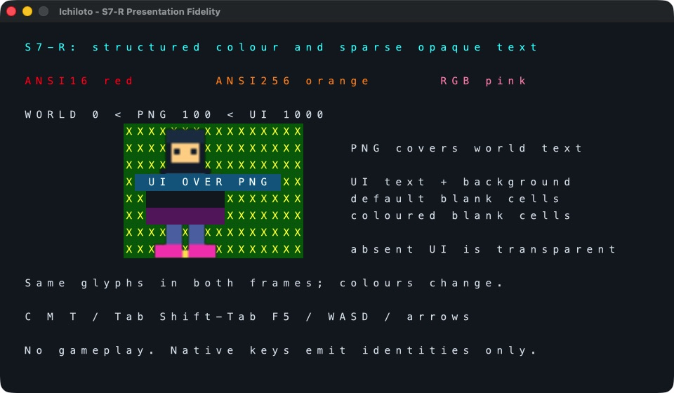
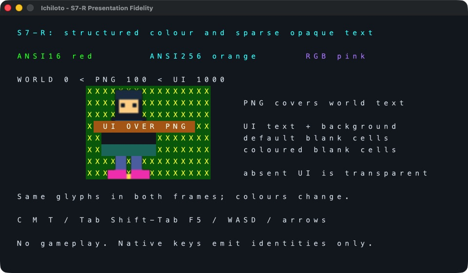
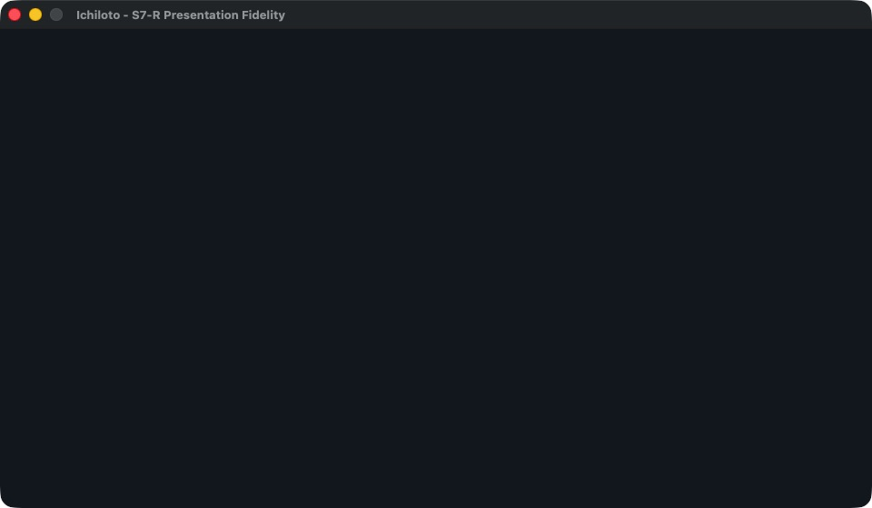
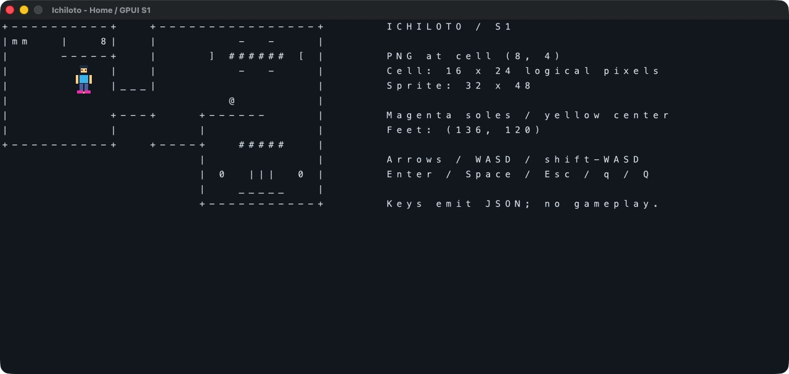

# S7-R validation and S7-E handoff

Validated 2026-09-11 on macOS 26.6.2 (25G83), Apple Silicon, Rust 1.98.1
(48a229cea), Cargo 1.98.1, locked GPUI 0.2.2. Starting renderer `develop`:
`c9e87bb56756a7f3d4b18948949be4aa13ddbc79`. The final S7-R commit containing this
record is the publication reference; see git history. Only this renderer repository
was modified. Engine, Last Legend, their branches/indexes and dependencies were not
changed. No PHP/game/native-audio process was used. All interactive fixtures were
silent, sequential and closed after validation.

## Gates

| Gate | Result |
| --- | --- |
| Baseline before edits | 22 passed, 0 failed |
| Full final Rust suite | 41 passed, 0 failed, 0 ignored |
| `cargo fmt --check` | Passed |
| `cargo clippy --all-targets --locked -- -D warnings` | Passed |
| `cargo build --locked` | Passed |
| Original v1 native IPC/lifecycle smoke cases | 7 passed |
| Added v2/session native IPC smoke cases | 6 passed |
| V1 native visual and actual input | Passed, 23 key events |
| V2 native colour, layering, blank-cell occlusion, style-only change | Passed |
| V2 native required input | Passed, 32 key events including additional editing/navigation keys |
| Native close | v2 `close_requested`, exit 0 |
| Protocol shutdown | v1 interactive exit 0; v1/v2 smoke exit 0; no close event |
| Channel separation | NDJSON-only stdout; stderr exactly expected diagnostics |
| Cleanup | No remaining fixture/renderer/game/audio process |

Upstream future-compatibility notices for `block 0.1.6` and `proc-macro-error2 2.0.1`
remain the same as baseline; they do not produce Clippy warnings in renderer code.
The unsupported-version smoke case now uses version 3 because version 2 is supported.

## Implementation and deterministic tests

V1 has its own typed frame contract and a `LegacyText` plan item before every sprite,
including negative sprite layers. V2 retains complete text-layer DTOs/styles and
prepared images, then stable-sorts text items followed by sprite items by numeric
layer. This yields text-before-sprite ties and stable array order within each type.
The UI consumes this exact plan, draws explicit backgrounds including spaces, then
optional glyphs at fixed configured cells. No font advance sets grid pitch.

No content equality filter exists. Every valid replacement calls `Context::notify()`;
IDs, numeric layers, ordered runs, nullable colours and sprite state remain intact.
Rejected frames never reach state replacement. Full empty snapshots clear all content.

The 41-test suite covers existing image/path/grid/v1 behavior plus strict v2 fields,
required explicit nullable colours, all tagged colour forms and ranges, palette
boundaries, UTF-8/scalar sizing, controls/tab/newline rejection, IDs and count limits,
exact painted-cell coordinates, opaque spaces/default backgrounds, overlapping-run
order, world/sprite/UI order, all equal-layer ties, same-label style-only replacement,
full clearing, atomic failed preparation, session version latching/mixed-message
rejection and every event kind's version. Input tests cover all ASCII letters,
f0..f20, PHP standalone names, case, Shift-Tab, chord rejection and explicit F-keys
with `function=true`. These unit tests are distinct from native evidence below.

## Native visual evidence

The unchanged Rust build was copied into the existing ignored local app bundle
`target/Ichiloto Renderer.app/Contents/MacOS/gpui-renderer` for CUA accessibility.
The committed fixture `fixtures/presentation-v2.ndjson` sets 60×22 cells at 16×24
logical pixels: content 960×528, screenshot 960×560 including the 32-point titlebar.
The sprite is the repository's existing calibration PNG, scaled 128×192, cell (16,13).
Its origin is (200,144), feet (264,336), relative to content. No game assets are used.

1. `scripts/inspect-fixture.py` sends v2 hello and first frame. World text is layer 0,
   the PNG layer 100, UI layer 1000. Head and feet cover world glyphs. UI text/background
   cuts across the PNG. The next UI stripe uses **seven explicit spaces with null
   background**, covering sprite/world with the renderer default. Another stripe uses
   seven coloured spaces. Absent UI cells leave the PNG/world visible.
2. `second` sends the next full snapshot. All run strings and glyph positions are
   identical. ANSI16 red changes to green, ANSI256 orange to cyan, RGB pink to violet;
   the UI background changes blue to brown and the coloured blank stripe purple to teal.
3. `invalid` sends a missing-asset frame. The v2 error is emitted and the last accepted
   second screenshot remains byte-for-byte identical: SHA256
   `8747924a2e8fd3a3e7dd66ae8b92a1717a3cdb9db6203d330ba14924daa5acfb`.
4. `clear` sends empty textLayers/sprites. The entire content becomes default background.
5. Actual native close emits the v2 close event and exits 0. Renderer PID 85764 stopped.





The v1 Home fixture retained text-first/sprites-second placement and its original
calibration sprite. Actual input was tested, then `shutdown` exited0 with empty
stderr and no close event. Renderer PID 88551 stopped.



## Exact native input evidence

Keys were sent through CUA to the actual focused native GPUI window, not injected
as protocol messages or passed straight to `normalize`. No user/game inputs were
mixed into these controlled runs. These events prove identities, not PHP actions.

[V2 exact event stream](evidence/s7-r/v2-events.ndjson) contains `ready`, these 32
keys in order, the deliberate missing-asset `error`, and `close_requested`; every
line has `protocol:2`:

```text
C M T tab shift_tab f5
up right down left
w a s d W A S D
enter space escape
c m t q Q
backspace delete home end page_up page_down
```

Command-W, Ctrl-C and Alt-X were then sent and emitted no degraded key events;
the window remained open. V2 stderr contains only the deliberate asset diagnostic:
[V2 stderr](evidence/s7-r/v2-stderr.log).

[V1 exact event stream](evidence/s7-r/v1-events.ndjson) contains `ready` and these 23
keys, all with `protocol:1`, followed by successful protocol shutdown (no event):

```text
up down left right w a s d W A S D enter space escape q Q
C M T tab shift_tab f5
```

[V1 stderr](evidence/s7-r/v1-stderr.log) is empty.

### GPUI and physical-input coverage limits

The installed GPUI 0.2.2 `src/platform/mac/events.rs:295-455` was read directly.
Its conversion maps `NSPageUpFunctionKey` to `pageup`, PageDown to `pagedown`,
Shift-Tab to `tab` with Shift, and native F1..F35 to lowercase names. Insert maps
`NSHelpFunctionKey`. It normally clears the Fn flag for the native special-key range.
This renderer translates those GPUI names to PHP vocabulary and accepts f0..f20.

Native F5 **was observed**. A separate attempt to send `fn+F5` through CUA was
rejected by the tool (`keyNotFound("fn")`) before any key delivery. Native Insert
was likewise unavailable in CUA (`keyPressNotSupportedByMacOS`). Accordingly:

- Native F5 is verified through real GPUI event delivery.
- `function=true` plus F-key handling is verified by Rust tests against the actual
  Keystroke API and macOS conversion source, **not claimed as a physical Fn press**.
- Insert and F0/uncommon standalone keys have normalization/API-source coverage,
  not physical native evidence. GPUI macOS does not expose a native F0 in that table.

No key-mapping hacks or renderer tracing hooks were added to manufacture evidence.

## Native IPC and lifecycle evidence

[Smoke results](evidence/s7-r/smoke-results.log) records 13 PASS. Per-case exact
stdout, stderr and exit files are in [the evidence directory](evidence/s7-r/smoke/).
The existing seven cases test fixture/shutdown, recoverable error, shutdown before
hello, fatal pre-hello EOF, unsupported protocol, broken stdout and unread stdout.
The six new real-process cases test:

- V2 fixture including same-glyph style replacement and shutdown.
- V2 malformed input, mixed v1 shutdown/frame and repeated v2 hello; errors remain v2.
- Invalid v2 asset-root hello -> error v1; valid v2 hello -> ready v2; malformed -> error v2.
- V1 rejects v2 shutdown/frame without stopping, then valid v1 shutdown succeeds.
- Invalid v2 colour followed by valid replacement.
- Invalid out-of-grid v2 run followed by empty replacement.

Each normal case parses every stdout line as JSON, checks exact event types/versions,
exit status, and stderr equals only the expected diagnostic messages. The broken and
unread stdout cases intentionally cannot provide a normal output transcript; both
exit 1 without hanging. Native close and normal shutdown exit 0 with drained output.

## S7-E contract

The Engine still sends v1 today. Renderer support alone does not restore game
colours, UI layering or transient timing; that remains separate S7-E work.

The complete schema, palette and rules are in [README](../README.md). In particular:

- Select v2 in hello; never mix versions in that process. Before a successful hello,
  protocol errors deliberately use the legacy v1 envelope. After success all events,
  including window-creation errors, use the chosen version. Do not downgrade on error.
- V1 frame DTOs remain supported unchanged. V2 uses required `textLayers` and `sprites`.
  Every layer requires `id/layer/runs`; every run requires `row/column/text/foreground/background`.
- Colours are tagged ansi16/ansi256/rgb; both null defaults are opaque (#D9E1E8/#111820).
  Serialize structured colour identities, never ANSI or CSS. Do not omit null fields.
- Preserve UI blank cells. Missing runs are transparent; explicit spaces clear lower
  content. Lower numeric layers paint first, ties text-first then sprites, stable
  array order. IDs and numbers carry no Rust gameplay semantics.
- Current bounds: 64 layers, 32768 runs, 524288 scalars, 256-byte text IDs per frame;
  existing 4 MiB line, grid and sprite limits continue. Empty run starts must be in-grid.
- No acknowledgement, deduplication, animation or timing was added. PHP owns labels,
  scene production and cadence. Same-label/same-glyph style changes still replace.
- Key events remain identities in both versions. PHP owns actions and bindings,
  including uppercase/lowercase meaning. No general modified-chord schema was added.
- Unicode remains scalar-per-cell; font metrics/spacing, terminal grapheme and wide
  characters have not been redesigned. Other platforms need their own native checks.

No tilemaps, sprite effects/source rectangles, animation state, audio, mouse gameplay,
gamepad input or S7-E implementation is included.
